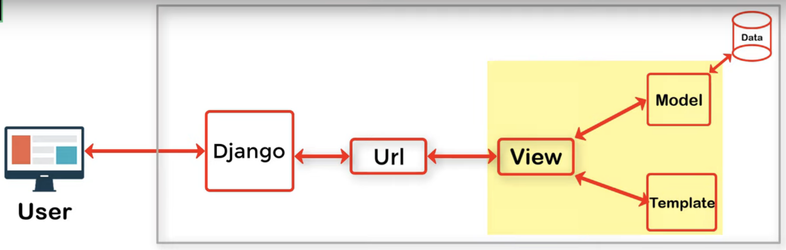
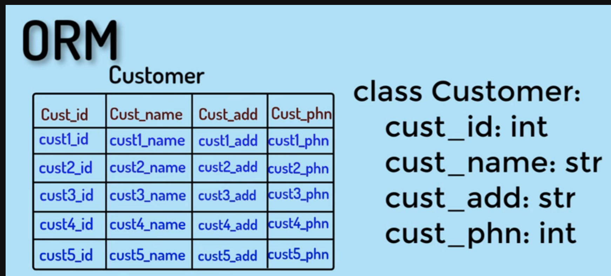

1. We need to create a seperate app for each model/function/requirement of our main project/website
2. `Django-admin startproject telusko ` can be used to start the Django project, which will create a folder and required files in that folder.
3. `python manage.py runserver` to start the Django light weight server 
4. `python manage.py startapp calce` to create a seperate app in your project
5. Added into git with below commands after creating new public repository
```
git init
git add .
git commit -m "Initial commit of telusko Django project"
git remote add origin https://github.com/hariiisai/mylearning.git
git branch -M main
git push -u origin main
#added Readme.md
git add .
(venv) apple@LAPTOP484-PN-IN telusko % git commit -m "Added readme file"
git push
```
### MVT 
```
M - Model
V - View
T - Template
```



### ORM



We have to setup postgres server on local to use this as database for our project
Then change below setings in setting.py
```
DATABASES = {
    "default": {
        "ENGINE": "django.db.backends.postgresql",
        "NAME": 'telusko',
        'USER': 'telusko',
        'PASSWORD' : 'Hari',
        'HOST': 'localhost'
    }
}
```

Then chnage the model as per Django model fields
```
class Destination(models.Model):
    
    name = models.CharField(max_length=100)
    img = models.ImageField(upload_to='pics')
    desc = models.TextField()
    price = models.IntegerField()
    offer = models.BooleanField(default=False)
```

#### Install postgres connector like psycopg2 
`pip install pyscopg2`

Add your app in INSTALLED_APPS list in settings.py 
```
INSTALLED_APPS = [
    "travello.apps.TravelloConfig", ## This is the line we need to add
    "django.contrib.admin",
    "django.contrib.auth",
```

#### Make migration now
`python telusko/manage.py makemigration`
If any error to install `pillow` package then install those packages
`pip install pillow` then makemigrations

once the migration is made you can see migrationfile created under migrations folder like `0001_initial.py`
`python telusko/manage.py sqlmigrate travello 0001`
This will show you the model creation sql query in postgres

Finally, start the migration which will create the tables in database
`python telusko/manage.py migrate`

Created a admin user :
`python telusko/manage.py createsuperuser` 
User: Hari

Register the model in admin.py
```
from .models import Destination

# Register your models here.
admin.site.register(Destination)
```
Now you can see destinations models in admin page and destinations from web page to database 

To upload images from admin web page we need seperate handler so add below lines to setting.py
`MEDIA_URL = '/media/'
MEDIA_ROOT = os.path.join(BASE_DIR,'media')`

Then add these URLs in main project urls.py
`urlpatterns = urlpatterns + static(settings.MEDIA_URL, document_root=settings.MEDIA_ROOT)`

Now we can provide destinations in admin page and those wil be inserted into database by Django
Change the images path from baseurl to img.url in index.html

##### Now we have a dynamic page where data can be come from database.

---END of Travello app-----

We will add user registration and login forms here, we will create a new app for this
`python telusko/manage.py startapp accounts`

We have created urls.py in accounts app and added this urls in main urls.py and created register.html

We can save this registration details as User object in PG database
```
def register(request):
    if request.method == 'POST':
        first_name = request.POST['first_name']
        last_name = request.POST['last_name']
        username = request.POST['username']
        password1 = request.POST['password1']
        password2 = request.POST['password2']
        email = request.POST['email']

        user = User.objects.create_user(username=username, password=password1, email=email,first_name=first_name,last_name=last_name)
        user.save();
        print('User created in databse')
        return redirect('/')
    else:
        return render(request,'register.html')
```
Created a register, login and logout functions in website.